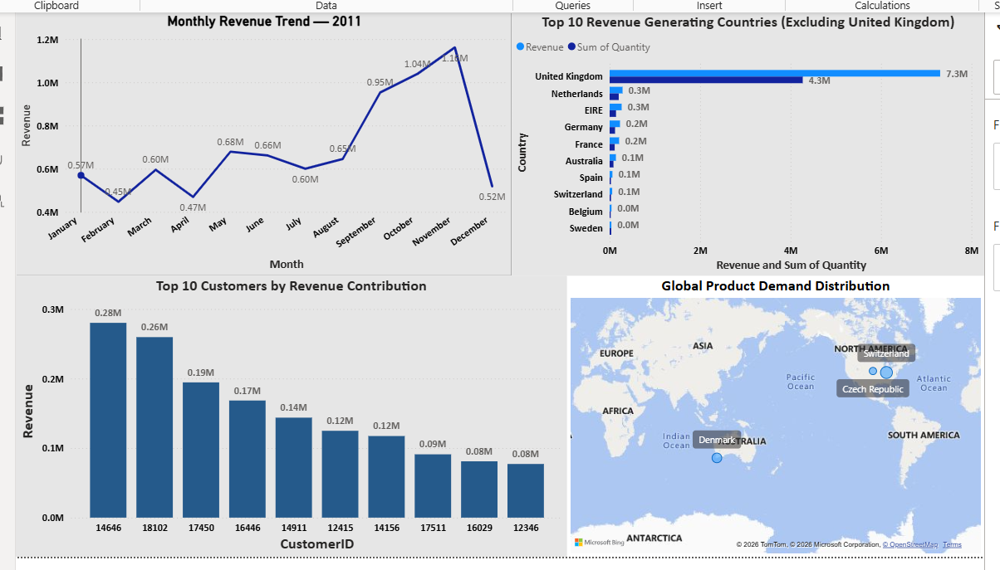

# 📊 Tata Data Visualization — Online Retail Executive Dashboard (Power BI)

**Author:** Seema Kumari  
**Program:** Tata Data Visualization Job Simulation (Forage)  
**Project Type:** Business Intelligence / Executive Dashboard  
**Tool Used:** Microsoft Power BI  

---

## 🔷 Project Title & Headline  
Online Retail Sales Analysis — 2011 Executive Dashboard  
An executive-level Power BI dashboard built to transform raw online retail transaction data into actionable business insights for leadership decision-making.

---

## 📝 Short Description  
This project presents a professional Power BI dashboard created during the Tata Data Visualization simulation. It analyzes 2011 online retail sales data and converts raw transactions into meaningful visual insights on revenue trends, customer contribution, and country-wise demand. The dashboard supports forecasting, customer strategy, and market expansion decisions.

---

## 🛠 Tech Stack  
- Microsoft Power BI  
- Power Query (Data Cleaning & Transformation)  
- DAX Measures & Calculated Columns  
- Data Modeling  
- Excel / CSV Dataset  

---

## 🗂 Data Source  
Dataset provided as part of the Tata Data Visualization simulation on Forage.  
It contains online retail transaction records including invoice numbers, products, quantities, prices, customers, and countries.  
All preprocessing and validation were performed inside Power BI.

---

## 🎯 Business Problem  

Executive leadership required visual analytics to answer key business questions:

- What are the monthly revenue trends for 2011?  
- Which countries generate the highest revenue outside the UK?  
- Who are the top revenue-contributing customers?  
- Where is global product demand strongest?  

The goal was to convert raw data into executive-ready dashboards for strategic planning.

---

## 🎯 Dashboard Goals  

- Analyze monthly revenue trends  
- Identify top 10 countries by revenue (excluding UK)  
- Rank top 10 customers by revenue contribution  
- Visualize global demand distribution  
- Support expansion and retention strategy  

---

## 🧹 Data Cleaning & Preparation  

Data preparation was completed using Power Query before visualization:

- Removed rows where Quantity ≤ 0 (returns & invalid entries)  
- Removed rows where Unit Price ≤ 0  
- Removed records with missing Customer ID  
- Corrected column data types  
- Created Year column from InvoiceDate  
- Created Month column for trend analysis  
- Created Month Number column for correct sorting  
- Applied Month → Sort by Month Number  

---


# 🧮 DAX Measures & Calculated Columns

## Revenue Measure

```DAX
Revenue =
SUMX(
    'Online Retail',
    'Online Retail'[Quantity] * 'Online Retail'[UnitPrice]
)
```

## Year Column

```DAX
Year = YEAR('Online Retail'[InvoiceDate])
```

## Month Column

```DAX
Month = FORMAT('Online Retail'[InvoiceDate], "MMM")
```

## Month Number (Sorting Column)

```DAX
Month Number = MONTH('Online Retail'[InvoiceDate])
```

**Sorting Applied:**
Month → Sort by Column → Month Number

---

## 📊 Key Insights  

- Revenue shows strong seasonal growth toward Q4  
- November is the highest revenue month  
- Revenue is concentrated among a small group of customers  
- Non-UK European markets contribute significantly  
- Demand clusters appear in Europe and selected global regions  
- Quantity sold does not always equal revenue — indicating pricing effects

  
## 🚀 Business Recommendations  

- Increase marketing in top revenue countries  
- Develop VIP programs for high-value customers  
- Prepare inventory for Q4 spikes  
- Target campaigns in high-demand regions  
- Investigate low-revenue months for improvement  

---

## 🖼 Dashboard Visual Preview  


---

## ⭐ Project Value  

This project demonstrates:

- End-to-end BI workflow  
- Data cleaning & validation discipline  
- DAX calculation skills  
- Executive dashboard design  
- Business storytelling with visuals  
- Decision-driven analytics approach
---
## 📌 About  

Completed a real-world style data visualization simulation task. Built executive dashboards, answered leadership questions, and delivered business insights for decision-making.
